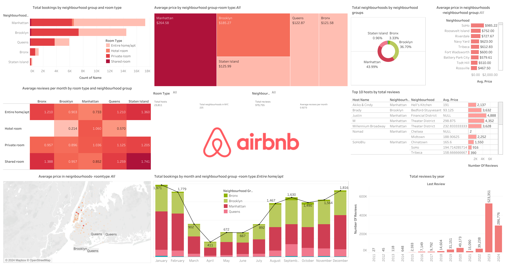

# NYC Airbnb Market Analysis
Comprehensive analysis of Airbnb data in New York City using Tableau. Discover trends in bookings, prices, reviews, and host performance across different neighborhoods and room types. Interactive visualizations offer insights into NYC's short-term rental market.Using data from [Inside Airbnb](https://insideairbnb.com/get-the-data), explore a variety of aspects such as bookings, pricing, reviews, and host activity.

[Tableau Public](https://public.tableau.com/app/profile/murali.krishna.avula/viz/Airbnb_NYC_17130500525390/Dashboard1)

## Data Sample

The dataset includes  information about NYC Airbnb listings, including:

- Unique identifiers for listings and hosts
- Room types (Entire home/apt, Private room, Shared room)
- Geographic location (neighborhood, latitude, longitude)
- Pricing, availability, and review metrics
- Historical data such as last review date and total number of reviews

## Key Visualizations and Insights

The project includes several key visualizations, each offering unique insights:

- **Total Bookings by Neighborhood Group and Room Type:** This visualization reveals which neighborhood groups are most popular for different room types, providing insights into demand trends.
  
- **Average Price by Neighborhood Group and Room Type (All):** An analysis of pricing across different neighborhood groups and room types, which can help identify areas with high or low average rates.

- **Total Neighborhoods by Neighborhood Groups:** Understand the distribution of Airbnb listings across NYC's neighborhoods, highlighting areas with more active short-term rental markets.

- **Average Price in Neighborhoods (All):** Compare the average price across NYC neighborhoods to spot potential high-value areas.

- **Average Reviews Per Month by Room Type and Neighborhood Group:** Analyze the frequency of reviews by room type and neighborhood group to understand guest satisfaction and rental turnover.

- **Total Bookings by Month and Neighborhood Group - Room Type (Entire Home/Apt):** Investigate booking trends over time for entire home/apt listings in different neighborhood groups.

- **Average Price in Neighborhoods - Room Type (All):** Discover variations in pricing within neighborhoods across different room types.

- **Total Reviews by Year:** Track review trends over time to assess market growth and guest feedback changes.

- **Top 10 Hosts by Total Reviews:** Identify high-performing hosts who have received the most reviews, providing insight into successful rental strategies.

## Notable Observations

- **Room Type Trends:** Entire home/apt tends to be the most popular room type, but there are specific neighborhood groups where private rooms are more common.

- **Price Differences:** Significant variations in average prices can be observed across different neighborhoods and room types, highlighting potential areas for investment or rental opportunities.

- **Booking Patterns:** Seasonal patterns in bookings may align with NYC's tourism seasons, offering clues for demand forecasting.

- **Host Performance:** Top hosts often have multiple listings and higher reviews per month, suggesting successful practices for managing short-term rentals.

## Viewing the Dashboard

- **Tableau Public:** You can view the dashboard online on [Tableau Public](https://public.tableau.com/app/profile/murali.krishna.avula/viz/Airbnb_NYC_17130500525390/Dashboard1). This link allows you to explore the visualizations interactively.
  
## Conclusion

This project provides insights into the NYC Airbnb market, highlighting trends and patterns across different neighborhood groups, room types, and hosts. It can be used for further analysis and decision-making in the short-term rental market.

